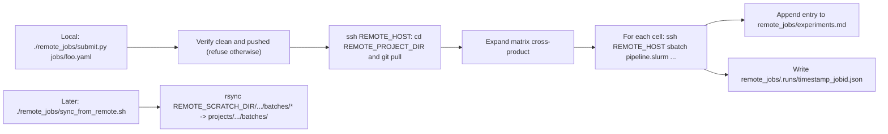

# remote_jobs: SLURM cluster deployment

Self-contained auto-psych runs on a SLURM-based cluster. No Firebase, no Cloud Run, no browser, no human-in-the-loop. Sherlock is the first target; other SLURM clusters work with minimal edits (see *Porting* below).

## What this does

You write a small YAML manifest describing a parameter sweep. `submit.py`:

1. Verifies your local git is clean and pushed.
2. SSHes to the cluster and `git pull`s the repo.
3. Expands the manifest's matrix cross-product into one `sbatch` per cell.
4. Records each submitted job in [`experiments.md`](experiments.md) with parameters, commit hash, and log paths.

Each job runs `run_pipeline.py` end-to-end on a compute node with `--mode simulated_participants_nobrowser` (LLM-as-participant, no browser) or `--ground-truth-model X` (deterministic sampling, no LLM in collect). Results land in `$REMOTE_SCRATCH_DIR/projects/<proj>/batches/<batch>/`. When the queue is empty you run `sync_from_remote.sh` and the batches drop into your local `projects/<proj>/batches/` tree as if you'd run them on your laptop.

## One-time setup

### Local

```bash
cp remote_jobs/.env.example remote_jobs/.env.local
# Edit remote_jobs/.env.local: REMOTE_HOST, REMOTE_PROJECT_DIR, REMOTE_SCRATCH_DIR
```

`REMOTE_HOST` should be an SSH alias defined in `~/.ssh/config` (recommended: keep ProxyJump/IdentityFile/ControlMaster local). On Sherlock with the standard config, the alias is usually `sherlock`.

### Remote (cluster login node)

```bash
ssh sherlock                                    # or your alias
git clone <REPO_URL> ~/auto-psych
cd ~/auto-psych
./remote_jobs/setup_remote.sh                   # creates venv, installs requirements-remote.txt
echo "GOOGLE_API_KEY=YOUR_KEY_HERE" > .secrets  # one line; .secrets is gitignored
chmod 600 .secrets
exit
```

`setup_remote.sh` is idempotent: re-running upgrades pip and reinstalls deps. On Sherlock it does `ml python/3.11`. On other clusters edit the `ml`/`module load` line (see *Porting*).

### Smoke

From your laptop:

```bash
./remote_jobs/smoke_infra.sh
```

This submits a tiny job (no LLM calls, no batch dir) that just imports `src` and writes a marker to scratch, then polls and rsyncs. Round-trip should take well under a minute. If this passes, your ssh + git pull + sbatch + rsync plumbing all work.

For an end-to-end check (real Gemini calls, real batch directory), run:

```bash
./remote_jobs/smoke_e2e.sh
```

Polls until the job is done, syncs back, runs `run_critic.py` over the rehydrated batch, and exits 0 only if all six agent validators pass.

## Submitting a job

```bash
./remote_jobs/submit.py remote_jobs/jobs/example_recovery.yaml
```

`submit.py` is fire-and-forget: it returns as soon as all `sbatch` calls have been issued. Job IDs and parameters are appended to [`experiments.md`](experiments.md) and persisted under `remote_jobs/.runs/` (gitignored). If git is dirty or unpushed, the submitter refuses unless you pass `--allow-dirty` (which records the dirty state in `experiments.md`).

To pull results back when a job (or batch of jobs) is done:

```bash
./remote_jobs/sync_from_remote.sh                              # all projects, all batches
./remote_jobs/sync_from_remote.sh --project subjective_randomness
./remote_jobs/sync_from_remote.sh --project subjective_randomness --pattern 'batch_2026*'
```

This rsyncs `$REMOTE_SCRATCH_DIR/projects/<proj>/batches/<pattern>/` into your local `projects/<proj>/batches/` and pulls the matching slurm `.out`/`.err` files into `remote_jobs/logs/<job_id>/`.

## Manifest format

```yaml
name: recovery_alternation              # used for sbatch --job-name and log filename prefix
project: subjective_randomness          # passed to run_pipeline as --project
mode: simulated_participants_nobrowser  # also accepts simulated_participants for the legacy browser path
n_participants: 5                       # passed as --n-participants
max_retries: 3                          # passed as --max-retries

matrix:                                 # cross-product expanded into one sbatch per cell
  ground_truth_model:                   # passed as --ground-truth-model (omitted for cells with value null)
    - alternation
    - prefer_more_heads
  runs:                                 # passed as --runs (single int N -> runs 1..N, or "A-B")
    - 5

slurm:                                  # resources for every cell (single value, not a matrix dim)
  time: "04:00:00"
  cpus_per_task: 4
  mem: "16G"
  partition: normal
```

Notes:

- Top-level scalar fields (`project`, `mode`, `n_participants`, `max_retries`) apply to every cell; they cannot appear under `matrix:`.
- All `matrix:` keys must be lists; `submit.py` expands the Cartesian product. The cell key order in the YAML determines the directory-naming order in `experiments.md`.
- If you want a cell with no `--ground-truth-model`, write `null` in the list (e.g. `[alternation, null]`); the submitter omits the flag for that cell.
- `runs:` accepts either an integer (`5`) -- runs 1 through N -- or a string range (`"4-6"`) per existing `run_pipeline.py` semantics.

## Submission flow



## Files in this directory

| Path | Purpose |
|------|---------|
| [`README.md`](README.md) | This file. |
| [`.env.example`](.env.example) | Template for `.env.local` (gitignored). |
| [`setup_remote.sh`](setup_remote.sh) | One-time cluster-side bootstrap. Creates venv, installs `requirements-remote.txt`. |
| [`remote_exec.sh`](remote_exec.sh) | Convenience: run an arbitrary shell command on the cluster inside the project dir. |
| [`pipeline.slurm`](pipeline.slurm) | Generic SLURM template; resources come from the submitter. |
| [`submit.py`](submit.py) | Read YAML manifest, expand matrix, ssh+sbatch each cell, log to `experiments.md`. |
| [`sync_from_remote.sh`](sync_from_remote.sh) | Rsync batch results and slurm logs back to the local repo. |
| [`smoke_infra.slurm`](smoke_infra.slurm) + [`smoke_infra.sh`](smoke_infra.sh) | Infra smoke (no Gemini calls). |
| [`smoke_e2e.sh`](smoke_e2e.sh) | End-to-end smoke (real Gemini + run_critic). |
| [`jobs/`](jobs/) | Committed YAML manifests. |
| [`experiments.md`](experiments.md) | Append-only journal of submissions (committed). |
| `.runs/` | Per-submission JSON (gitignored). |
| `logs/` | Slurm `.out`/`.err` files pulled back by sync (gitignored). |

## Porting to another SLURM cluster

The directory and env-var names are cluster-agnostic. To target a second cluster:

1. **`.env.local`** -- set `REMOTE_HOST` to the new SSH alias, `REMOTE_PROJECT_DIR` to wherever you cloned auto-psych on it, and `REMOTE_SCRATCH_DIR` to whichever scratch path the cluster exposes (`$WORK`, `$GROUP_HOME`, `$SLURM_TMPDIR/...`, etc.).
2. **`pipeline.slurm`** -- the only Sherlock-flavored line is the `ml python/3.11` near the top. Swap to whatever your cluster needs (`module load python/3.11.4`, `module load anaconda3 && conda activate auto-psych`, or remove the load entirely if Python 3.11 is on `$PATH`).
3. **`setup_remote.sh`** -- same module-load consideration as `pipeline.slurm`.
4. **Manifest `slurm:` block** -- partition names vary across clusters (`normal` on Sherlock, `cpu` on Della, etc.); update the partition in your manifests as needed. Time/cpu/mem syntax is the same SLURM standard everywhere.

That's it. No multi-site config layer, no profile files. If you find yourself supporting two clusters routinely we can promote those four edits to a profiles directory; for one cluster it's overkill.
